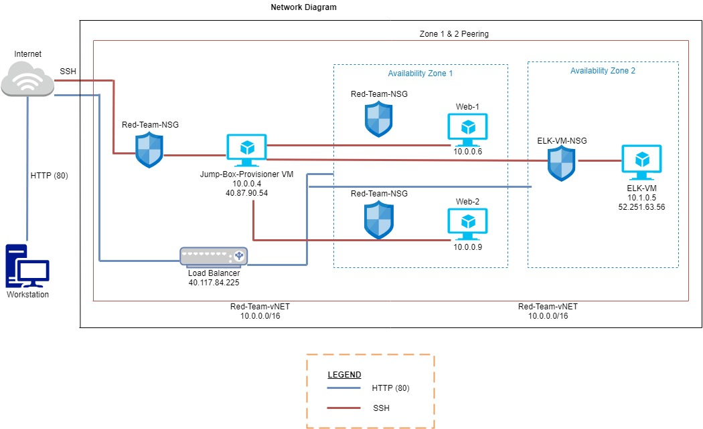
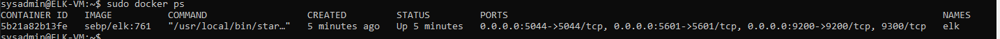
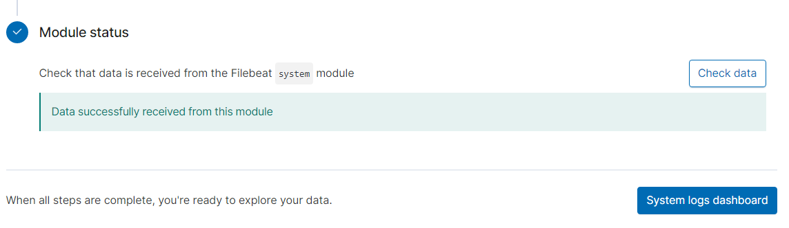
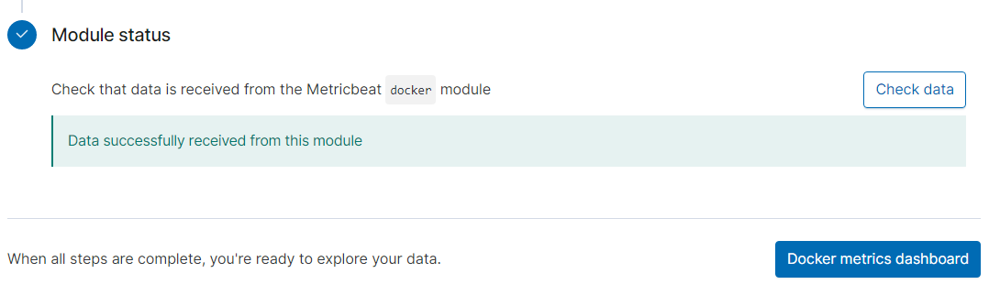

Jeffrey Anunciacion
Cybersecurity Boot Camp

## Automated ELK Stack Deployment

The files in this repository were used to configure the network depicted below.

These files have been tested and used to generate a live ELK deployment on Azure. They can be used to either recreate the entire deployment pictured above. Alternatively, select portions of the Networking Diagram file may be used to install only certain pieces of it, such as Filebeat.

This document contains the following details:
- Description of the Topologu
- Access Policies
- ELK Configuration
  - Beats in Use
  - Machines Being Monitored
- How to Use the Ansible Build

### Description of the Topology

The main purpose of this network is to expose a load-balanced and monitored instance of DVWA, the D*mn Vulnerable Web Application.

Load balancing ensures that the application will be highly functional, in addition to restricting high-traffic to the network.
 
- What aspect of security do load balancers protect?
   - It helps to prevent overloading servers and optimizes productivity.
   - It adds strength by rerouting the live traffic from one server to another causing it to eliminate single points of failure from attacks (ex. DDoS attack).

- What is the advantage of a jump box?_
   - Jump box are high secured computers that are never used for non-admin tasks. Advantages are Automation, Access Control, and Security.

Integrating an ELK server allows users to easily monitor the vulnerable VMs for changes to the network and system logs.
- What does Filebeat watch for?
   - It monitors the log files or locations that you specify and forwards them to Elasticsearch/Logstash for recording.

- What does Metricbeat record?
   - It records metrics/statistics data and transports them to the output that you specifics thru Elasticsearch/Logstash.

The configuration details of each machine may be found below.
_Note: Use the [Markdown Table Generator](http://www.tablesgenerator.com/markdown_tables) to add/remove values from the table_.

| Name     | Function   |         IP Address        | Operating System |
|----------|------------|---------------------------|------------------|
| Jump Box | Gateway    | 10.0.0.1/52.152.162.128   | Linux            |
| ELV-VM   | Web Server | 10.1.0.5/13.77.74.59      | Linux            |
| Web-1    | Web Server | 10.0.0.6                  | Linux            |
| Web-2    | Web Server | 10.0.0.9                  | Linux            |

### Access Policies

The machines on the internal network are not exposed to the public Internet. 

Only the ELK Server machine can accept connections from the Internet. Access to this machine is only allowed from the following IP addresses:
 - 67.70.119.158 (LocalHost IP address)

Machines within the network can only be accessed by Jump-Box Provisioner.
 - Which machine did you allow to access your ELK VM? 
    - Jump-Box Provisioner

 - What was its IP address?
    - 10.0.0.1/52.152.162.128

A summary of the access policies in place can be found in the table below.

| Name       | Publicly Accessible |           Allowed IP Addresses             |
|------------|---------------------|--------------------------------------------|
| Jump Box   | No                  | Workstation Public IP Address / SSh (22)   |
| Web-1      | No                  | 10.0.0.6 on SSH (22)                       |
| Web-2      | No                  | 10.0.0.9 on SSH (22)                       |
| ELK Server | No                  | Workstation Public IP using TCP 5601       |

### Elk Configuration

Ansible was used to automate configuration of the ELK machine. No configuration was performed manually, which is advantageous because...
 - What is the main advantage of automating configuration with Ansible?_
    - One main advantage is having YAML Playbooks. They are the best alternative for configuration management/automation.

The playbook implements the following tasks:
 - In 3-5 bullets, explain the steps of the ELK installation play. E.g., install Docker; download image; etc._
    - SSH into Jump-Box Provisioner (ssh sysadmin@52.152.162.128)
    - Start and Attach the Ansible docker (sudo docker start fervent_montalcini / sudo docker attach fervent_montalcini)
    - Create the install-elk.yml in the /etc/ansible/roles directory ()
    - Ran the install-elk.yml in the same directory.
    - SSH into the ELK-VM to verify the server is up and running.

The following screenshot displays the result of running `docker ps` after successfully configuring the ELK instance.

### Target Machines & Beats
This ELK server is configured to monitor the following machines:
 - List the IP addresses of the machines you are monitoring_
    - Web-1 (10.0.0.6)
    - Web-2 (10.0.0.9)

We have installed the following Beats on these machines:
 - Specify which Beats you successfully installed_
    - 
    - 

These Beats allow us to collect the following information from each machine:
 - In 1-2 sentences, explain what kind of data each beat collects, and provide 1 example of what you expect to see. E.g., `Winlogbeat` collects Windows logs, which we use to track user logon events, etc._
    - Filebeat is used to collect log files from specific files on remote machines. Examples of filebeats can be files that are generated by Microsoft Azure tools, Apache, or MySQI databases.
    - Metricbeat collects machine metrics. It is a measurement to tell analysts how healthy it is. Examples could be CPU usage/Uptime.

### Using the Playbook
In order to use the playbook, you will need to have an Ansible control node already configured. Assuming you have such a control node provisioned: 

SSH into the control node and follow the steps below:

FILEBEAT:
- Copy the filebeat-config.yml file to /etc/ansible/roles/files.
- Update the filebeat-config.yml file to include the ELK private IP in lines 1106 and 1806.
- Run the playbook, and navigate to http://13.77.74.59:5601/app/kibana (ELK-VM public IP) to check that the installation worked as expected.

METRICBEAT:
- Copy the metricbeat-config.yml file to /etc/ansible/roles/files.
- Update the metricbeat-config.yml file to include the ELK Private IP in lines 62 and 96.
- Run the playbook, navigate to http://13.77.74.59:5601/app/kibana (ELK-VM public IP) to check that the installation worked as expected.

Answer the following questions to fill in the blanks:_
- Which file is the playbook? filebeat-playbook.yml

- Where do you copy it? /etc/ansible/roles

- Which file do you update to make Ansible run the playbook on a specific machine? /etc/ansible/hosts file (IP of the Virtual Machines).

- How do I specify which machine to install the ELK server on versus which to install Filebeat on?
   - In the /etc/ansible/hosts file, one of the groups will be [webservers] which was the IPs of the VMs that I will install Filebeat to. The other group is named [elkservers]      which will have the IP of the VM I will install ELK to.

- Which URL do you navigate to in order to check that the ELK server is running? http://13.77.74.59:5601/app/kibana
